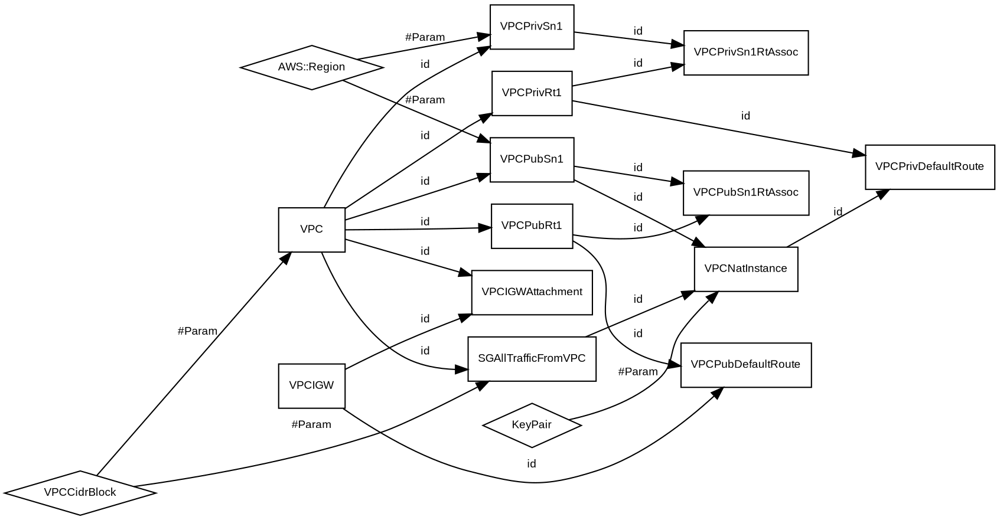

# Dependency Graph

One of the main reasons I constructed this library was to be able to understand the dependencies between all the inputs, resources and outputs of a template. For this I emplyed the [QuikGraph](https://github.com/KeRNeLith/QuikGraph) package to construct a directed edge graph of the dependencies at the end of the deserialization. Understanding the dependencies allows you to perform a few useful tricks. For instance, you can create a visualisation of the template as a DOT graph that can be viewed using [GraphViz](https://graphviz.org/) tools, or you could create a linter. This library parses CloudFormation _much_ faster than any of the well-known Python tools out there, but I will admit is much less mature. For instance, this library currently does not [directly support SAM templates](./caveats.md), though it should not error when reading them.

See the `TestHelpers` project to see how to create a DOT language representation of the template that can be viewed in online renderers such as [GraphVizOnline](https://dreampuf.github.io/GraphvizOnline) or passed to APIs such as [QuickChart.io](https://quickchart.io/graphviz) to get back SVG (post the DOT string to https://quickchart.io/graphviz).

## Example

From a deserialization of [this template](https://github.com/awslabs/aws-cloudformation-templates/blob/master/aws/services/CloudFormation/MacrosExamples/Public-and-Private-Subnet-per-AZ/Create-Stack.yaml), the following DOT graph can be generated. [Click here](https://dreampuf.github.io/GraphvizOnline/#digraph%20G%20%7B%0D%0Arankdir%3DLR%0D%0Anode%20%5Bfontname%3D%22Arial%22%2C%20fontsize%3D9%5D%3B%0D%0Aedge%20%5Bfontname%3D%22Arial%22%2C%20fontsize%3D9%5D%3B%0D%0A0%20%5Bshape%3Ddiamond%2C%20label%3D%22VPCCidrBlock%22%5D%3B%0D%0A1%20%5Bshape%3Ddiamond%2C%20label%3D%22KeyPair%22%5D%3B%0D%0A2%20%5Bshape%3Dbox%2C%20label%3D%22VPC%22%5D%3B%0D%0A3%20%5Bshape%3Dbox%2C%20label%3D%22VPCPubSn1%22%5D%3B%0D%0A4%20%5Bshape%3Dbox%2C%20label%3D%22VPCPrivSn1%22%5D%3B%0D%0A5%20%5Bshape%3Dbox%2C%20label%3D%22VPCPubRt1%22%5D%3B%0D%0A6%20%5Bshape%3Dbox%2C%20label%3D%22VPCPubSn1RtAssoc%22%5D%3B%0D%0A7%20%5Bshape%3Dbox%2C%20label%3D%22VPCPrivRt1%22%5D%3B%0D%0A8%20%5Bshape%3Dbox%2C%20label%3D%22VPCPrivSn1RtAssoc%22%5D%3B%0D%0A9%20%5Bshape%3Dbox%2C%20label%3D%22VPCPubDefaultRoute%22%5D%3B%0D%0A10%20%5Bshape%3Dbox%2C%20label%3D%22VPCPrivDefaultRoute%22%5D%3B%0D%0A11%20%5Bshape%3Dbox%2C%20label%3D%22VPCIGW%22%5D%3B%0D%0A12%20%5Bshape%3Dbox%2C%20label%3D%22VPCIGWAttachment%22%5D%3B%0D%0A13%20%5Bshape%3Dbox%2C%20label%3D%22SGAllTrafficFromVPC%22%5D%3B%0D%0A14%20%5Bshape%3Dbox%2C%20label%3D%22VPCNatInstance%22%5D%3B%0D%0A15%20%5Bshape%3Ddiamond%2C%20label%3D%22AWS%3A%3ARegion%22%5D%3B%0D%0A0%20-%3E%202%20%5Blabel%3D%22%23Param%22%5D%3B%0D%0A0%20-%3E%2013%20%5Blabel%3D%22%23Param%22%5D%3B%0D%0A1%20-%3E%2014%20%5Blabel%3D%22%23Param%22%5D%3B%0D%0A2%20-%3E%203%20%5Blabel%3D%22id%22%5D%3B%0D%0A2%20-%3E%204%20%5Blabel%3D%22id%22%5D%3B%0D%0A2%20-%3E%205%20%5Blabel%3D%22id%22%5D%3B%0D%0A2%20-%3E%207%20%5Blabel%3D%22id%22%5D%3B%0D%0A2%20-%3E%2012%20%5Blabel%3D%22id%22%5D%3B%0D%0A2%20-%3E%2013%20%5Blabel%3D%22id%22%5D%3B%0D%0A3%20-%3E%206%20%5Blabel%3D%22id%22%5D%3B%0D%0A3%20-%3E%2014%20%5Blabel%3D%22id%22%5D%3B%0D%0A4%20-%3E%208%20%5Blabel%3D%22id%22%5D%3B%0D%0A5%20-%3E%206%20%5Blabel%3D%22id%22%5D%3B%0D%0A5%20-%3E%209%20%5Blabel%3D%22id%22%5D%3B%0D%0A7%20-%3E%208%20%5Blabel%3D%22id%22%5D%3B%0D%0A7%20-%3E%2010%20%5Blabel%3D%22id%22%5D%3B%0D%0A11%20-%3E%209%20%5Blabel%3D%22id%22%5D%3B%0D%0A11%20-%3E%2012%20%5Blabel%3D%22id%22%5D%3B%0D%0A13%20-%3E%2014%20%5Blabel%3D%22id%22%5D%3B%0D%0A14%20-%3E%2010%20%5Blabel%3D%22id%22%5D%3B%0D%0A15%20-%3E%203%20%5Blabel%3D%22%23Param%22%5D%3B%0D%0A15%20-%3E%204%20%5Blabel%3D%22%23Param%22%5D%3B%0D%0A%7D) to see a visualization.

